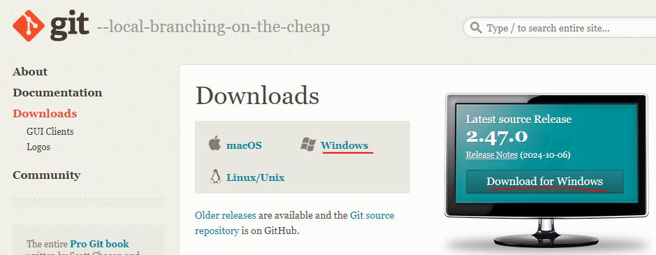
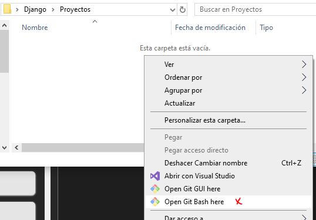

# **Proyecto_estetica**
### Para personalizar el readme
https://www.youtube.com/watch?v=lGnvLt78sl8
https://readme.so/es
...

## **ENV-Entorno virtual**

Al trabajar con github, hay ciertas carpetas que contienen muchicimos archivos. Al momento de clonar o subir estos repositorios, toman una gran cantidad de tiempo para realizarlos, es por eso que se debe de ignorarlos, ya que se pueden descargar rapidamente por separado.

**Creacion de entorno**: py -m venv [Entorno]

Recomiendo que lo llamen "venv" y que la carpeta se ubique junto al archivo manage.py

### Lista de librerias:
- **Django**

## **GIT INSTALACION**

Para descargar el entorno de github, se debe de instalar git accediendo mediante la url https://git-scm.com/downloads.

<div align="center">

</div>

En la imagen podemos acceder a la descargar mediante las 2 opciones subrayadas.

<div align="center">

</div>

Dependiendo nuestro microprocedaor(Creo que ya todos tienen tecnologia de 64bits) seleccionamos la opcion que se adapte a nuestro sistema, dando asi el inicio de la descarga. Durante la instalacion del git, le dan a next, dejandolo por defecto a cada una de las opcion. Una vez terminado la instalacion, para empezar a usar git, se debe de acceder a su terminal bash, mediante el click derecho del mouse, en el le aparecera nuevas opciones relacionados a este.

<div align="center">

</div>

**Ahora en visual studio es posible utilizar la terminal Bash**

## **GIT COMANDOS**

### Tu Identidad

Lo primero que deberás hacer cuando instales Git es establecer tu nombre de usuario y dirección de correo electrónico. Esto es importante porque los "commits" de Git usan esta información, y es introducida de manera inmutable en los commits que envías:

```bash
  $ git config --global user.name "[nombre de usuario]"
  $ git config --global user.email [Email de github]
```

De nuevo, sólo necesitas hacer esto una vez si especificas la opción --global, ya que Git siempre usará esta información para todo lo que hagas en ese sistema. Si quieres sobrescribir esta información con otro nombre o dirección de correo para proyectos específicos, puedes ejecutar el comando sin la opción --global cuando estés en ese proyecto.

Muchas de las herramientas de interfaz gráfica te ayudarán a hacer esto la primera vez que las uses.

### Clonando un repositorio existente

Puedes clonar un repositorio con git clone [url].

```bash
  $ git clone https://github.com/J-Joel/Proyecto_estetica
```

### Revisando el Estado de tus Archivos

La herramienta principal para determinar qué archivos están en qué estado es el comando git status.

```bash
  $ git status
```

Un archivo puede estar en el estado 
- **Rojo**: El archivo es reconocido por git pero no esta habilitado para subirlo
- **Verde**: El archivo ya fue habilitado y esta preparado para comfirmar el cambio al repositorio.

### Añadir Archivos Nuevos al repositorio

Para prepararlo o hablitar los archivos, se ejecuta el comando add

Este comando cumple varios propósitos - lo usas para empezar a añadir archivos nuevos, preparar archivos, y hacer otras cosas como marcar archivos en conflicto por combinación como resueltos

Este comando puede ir añadiendo archivos por archivos, o completamente todo el listados que se muestra con el comando $ git status.

```bash
  $ git add [nombre archivo/carpeta]
  $ git add . (añade todo los archivos)
```

### Confirmar Cambios

Para comfirar los cambios de los archivos añadidos por add, se debe usar el comando

```bash
  $ git commit -m "Descripcion general de lo que se cambio"
```

Con el parametro **-m** indicamos el mensaje que se mostrara al realizar el cambio dentro del repositorio, este se visualizara para todos los integrantes dentro del repositorio(Es necesario tener configurado el usuario)

### Subir los cambios al repositorio

Usa git push para insertar confirmaciones realizadas en la rama local en un repositorio remoto.

```bash
  $ git push origin main
```
